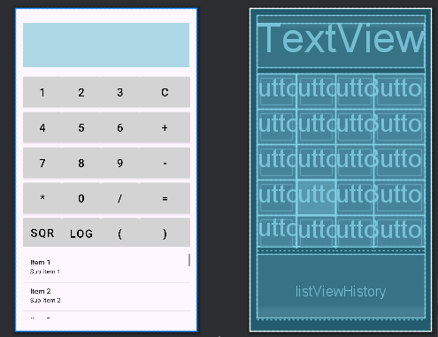

#issues
某些代码更新时，需要clean project rebuilt project 然后重启模拟器才能改变。\
判定事件是否绑定好，有没有正确运行的时候可以用到logcat，打好TAG 过滤就能看到各种值的变化\
布局采用了嵌套的方式，最外层是scollview包含全部以保证可以下滚历史记录，里面是textView是显示屏\
再里层是GridView来网格布局方便放各种button.最后下面是一个listView历史记录。
